# Web overnight — 2026-07-15 (apps/web, branch `dev`)

Autonomous frontend session covering the admin promo codes panel, admin
overview pages for recurring bookings and referrals, and wiring three
client-app stubs (favorites, promo check, support) plus a new referral
screen to the real backend. Scope was `apps/web/**` only — `apps/api`
and `apps/mobile` were not touched. Committed in small, per-feature
commits on `dev`, no `git add -A`.

Verification: `npm run check` (`vite build`) after every change, plus
live browser checks of every new/changed client screen (home, favorites,
promo, support, referral — both logged-out states, which is the only
state reachable without a live backend) with zero console errors. The
admin panel's new pages (promo codes, recurring bookings, referrals)
were code-reviewed against the same shared components already used by
the working Regions/Applications/Support pages, and further checked by
temporarily monkey-patching `fetch` in the live preview to confirm they
render with realistic sample payloads. A full logged-in admin walkthrough
against a real database was not possible — no local Postgres/Docker
available this session (see `reference_local_backend_env` memory) — so
stopped at that static/simulated verification rather than forcing a
local backend up.

---

## 1. Admin: promo codes panel

New "Промокоды" nav section in `AdminApp.jsx`. Table-style cards (code,
region, discount, min order price, usage limits, validity, status).
- Create via the existing `POST /api/admin/promo-codes`.
- Toggle active via the existing `PATCH /api/admin/promo-codes/:id/status`.
- Delete via `DELETE /api/admin/promo-codes/:id` — confirmed against
  `docs/status/server-overnight-2026-07-15.md` (backend session added
  this tonight too); maps its `409 PROMO_CODE_HAS_REDEMPTIONS` to a
  specific message telling the admin to deactivate instead.
- No "edit all fields" modal: the API only exposes create + status
  toggle + delete for promo codes, so a full-edit form would have
  silently discarded whatever it couldn't actually persist.

## 2. Admin: recurring bookings overview

Read-only "Регулярные поездки" page — `GET /api/admin/recurring-bookings`,
optional status filter (PENDING_DRIVER/ACTIVE/PAUSED/CANCELLED). Shows
client/driver names, route, days of week, time, price.

## 3. Admin: referrals overview

Read-only "Рефералы" page — `GET /api/admin/referrals`, one row per
referred client (inviter → invitee, reward amount, credited or pending).

## 4. Admin: support page lost-item visibility

The support ticket admin page already existed and already showed
`order_id`, topic and the full message — the one gap was that the
client's "Забыл вещь" topic wasn't a stable value the backend could
match on (see §7). Added a distinct badge/label for that topic once the
client side sends the correct code.

## 5. Client: favorites wired to the real API

`FavoritesSection` now loads/adds/deletes via
`GET/POST/DELETE /api/favorites/addresses`, reusing the existing
`AddressPicker` map-search component (new `mode="favorite"`) instead of
building a second address picker. Shows a login prompt when signed out,
loading/error/empty states otherwise.

## 6. Client: promo code check wired to the real API

`PromoSection` now calls `POST /api/orders/promo/validate` for real.
Since this screen lives in the menu (no active trip price to validate
against), added an "expected trip price" input alongside the code —
the endpoint requires a concrete `orderPriceKzt` to compute a discount,
so this was the honest way to keep the check meaningful rather than
faking a stub result.

## 7. Client: support submission wired to the real API

`SupportSection` now submits to `POST /api/support` (attaching the
active order id when there is one) instead of only setting local
"prepared" state and telling the user it wasn't connected yet.
Also fixed a correctness bug found while cross-checking the backend
status doc: the "Забыл вещь" topic must be sent as the literal string
`LOST_ITEM` for the backend to notify that order's driver — sending the
Russian label (what the first pass did) would have silently never
matched. Other topics stay as plain Russian text (support messages have
no topic enum otherwise).

## 8. Client: referral screen

New "Пригласить друга" menu entry / screen — own code, copy/share
button, invited count and bonus total from `GET /api/referrals/me`.
Not done: adding a "redeem a friend's code" field to registration
(backend already accepts an optional `referralCode` there). Skipped
deliberately — the registration/auth screens are explicitly called out
in memory as another parallel session's territory tonight, so this was
left alone rather than risking a conflicting edit.

## 9. General polish

- `formatError`/`authMessage` (client) and `readError` (admin) no longer
  fall back to the raw `error.message` from a failed request. With no
  backend reachable in this environment that fallback was showing
  English technical strings (e.g. `Failed to fetch`) directly to users
  — replaced with a generic friendly Russian message, on top of the
  existing per-code mappings. This affects every screen in both apps,
  not just tonight's new ones.
- Reused existing shared CSS/components everywhere (`ModalFrame`,
  `PageHeader`, `Badge`, `InfoLine`, `DataCard`, `StatePanel`,
  `SegmentedFilter`, `admin-application-card`) rather than introducing
  new one-off styles, so the new admin pages match the existing pages'
  spacing/typography/icons without a new stylesheet pass. Added only
  three small new CSS blocks (`.favorite-row-premium`,
  `.referral-code-block`, `.info-line-client`) for client-side pieces
  that had no existing equivalent.

---

## 10. Follow-up: price-offer negotiation + quick messages (QA-flagged gap)

QA found these two features were backend-only — `apps/api` had shipped
`POST /orders/:id/price-offer`, `/price-offer/respond` and
`/quick-message` (see §1/§8 of `server-overnight-2026-07-15.md`), but
`ClientApp.jsx` never called either one.

- **Price-offer**: on the `SEARCHING_DRIVER` screen, when the order has
  `driver_offer_status === "PENDING"` and a `driver_offer_price_kzt`,
  a card now shows "Водитель предлагает X ₸ / Вместо Y ₸" with
  Согласиться/Отказаться → `POST /orders/:id/price-offer/respond
  { accept }`. No new socket wiring needed: `emitOrderUpdated` always
  also emits `order_status_public` to the order's room regardless of
  the named event, and the client's existing socket listener on that
  event already flows the updated order back through `onOrderUpdate`.
- **Quick messages**: a fixed-vocabulary button bar (matching the
  server's exact `QUICK_MESSAGES` keys — `I_ARRIVED`,
  `WAITING_AT_ENTRANCE`, `RUNNING_LATE_2MIN`, `PLEASE_COME_OUT`,
  `ON_MY_WAY` — confirmed by reading `orders.routes.js` directly rather
  than guessing) on every active-trip screen from driver-found through
  trip-started, `POST /orders/:id/quick-message { messageKey }`.
- **Incoming messages**: `notifyOrderClient`/`notifyOrderDriver` only
  write a `notifications` row and send a mobile push — there is no
  socket event for this, so a web toast can't just listen for one.
  Added an 8s poll of `GET /api/notifications` while an order is
  active, filtering `type === "QUICK_MESSAGE"` for the current
  `order_id`, showing a dismissing toast banner and marking it read via
  `POST /api/notifications/:id/read` so it isn't shown twice.

**Verification**: `npm run check` clean; confirmed the app still boots
with zero console errors with the new always-mounted (but
order-gated) poll effect. Reaching `SEARCHING_DRIVER` with a pending
offer, or an active trip with an incoming quick message, requires a
real order end-to-end (pickup → destination → tariff → route → create)
against a live backend to see rendered — not reproducible via the
fetch-mock trick used for the admin pages without also faking the
whole order-creation prerequisite chain. Not done tonight; the code
was instead verified by exact field-name/endpoint cross-check against
`apps/api/src/modules/orders/orders.routes.js` and
`order-dispatch.service.js` (`driver_offer_price_kzt`,
`driver_offer_status`, `driver_offer_by_driver_id`, `price`, and the
`QUICK_MESSAGES` key list are all read verbatim from that source, not
guessed).

## 11. Follow-up: driver raffles, ratings (overall + per-raffle), tariff
    commission visibility, payout requests

Four more asks, all `apps/web`-only:

- **Raffles ("Розыгрыши")**: new admin section — create a period
  (title/startsAt/endsAt), list, delete with confirm. **No backend
  endpoint exists for this yet** — same pattern as recurring-bookings/
  referrals earlier tonight: built against an assumed REST contract so
  a backend session can pick it up:
  - `GET /api/admin/raffles` → `{ raffles: [{ id, title, startsAt,
    endsAt, createdAt }] }`
  - `POST /api/admin/raffles` body `{ title, startsAt, endsAt }`
    (ISO datetimes) → `{ raffle }`
  - `DELETE /api/admin/raffles/:id` → `204`/`{}`
  - The ask that "trips completed in this period automatically count"
    is backend aggregation logic (join `orders`/`driver_reviews` by
    date range) — nothing to build client-side for that beyond letting
    the admin pick a period, which the leaderboard filter below does.
- **Driver ratings — two views**: extended the existing "Качество"
  page (didn't duplicate it) with a segmented "Общий рейтинг" / "За
  розыгрыш" toggle. Per-raffle mode adds a raffle `<select>` and calls
  `getAdminLeaderboard({ dateFrom, dateTo })` using the selected
  raffle's bounds. **`GET /api/admin/leaderboard` currently ignores
  query params entirely** (read the route directly — no `dateFrom`/
  `dateTo` parsing) — this is the second half of the assumed contract:
  the backend needs to add optional date-range filtering to that
  existing endpoint (join `orders` on `completed_at` or `created_at`
  between the bounds) for the per-raffle view to actually differ from
  the overall one. Until then it silently returns the same all-time
  leaderboard regardless of which raffle is selected — not broken, just
  not filtered yet.
- **Review deletion (moderation)**: delete button + confirm modal on
  every review card ("Отзыв будет удалён... Используйте для явно
  накрученных или оскорбительных отзывов"), wired to
  `DELETE /api/admin/reviews/:id`. **Also not implemented on the
  backend yet** — `admin.routes.js` only has `GET /reviews` and the
  client-facing `POST /driver-reviews`, no delete. Needs to also
  re-average the driver's `rating` column after removal (mirroring the
  `AVG(rating)` update `POST /driver-reviews` already does on insert)
  or the driver's displayed rating will drift from their visible
  review list.
- **Tariff commission visibility**: the field already existed
  (`serviceCommissionPercent`) in both the tariff card and edit form —
  the real problem was the *card* view had two different `InfoLine`s
  both labeled plain "Комиссия": one the tariff's commission **rate**
  (%), the other the period's commission **total** (₸). Renamed the
  rate one to "Комиссия сервиса, %" (matching the exact wording asked
  for) to disambiguate; also updated the edit form's label from
  "Комиссия сервиса %" to the same wording for consistency. No backend
  change needed — this was a labeling bug, not a missing feature.
- **Payout requests**: new "Выплаты" admin section — this one needed
  no assumed contract, `apps/api` already had it end to end
  (`GET/PATCH /api/admin/payout-requests`, `wallet.service.js`).
  Status filter (PENDING default), approve/mark-paid/reject actions;
  reject requires a reason via a small modal, matching how the backend
  stores `rejection_reason`.

**Verification**: `npm run check` clean. Live-verified all four in the
browser via a temporary `window.fetch` mock (raffles list + create
banner, quality page's raffle toggle + raffle-scoped leaderboard
message + review-delete confirm, payouts list with approve/reject/
mark-paid actions and the reject-reason modal, and the tariff card's
now-disambiguated commission label) — zero console errors in every
case. Real end-to-end behavior (raffle CRUD persisting, leaderboard
actually differing by period, review deletion re-averaging a driver's
rating, payout status transitions) still needs the backend additions
listed above plus a live database; not done tonight per the same local-
backend limitation as everything else in this doc.

## 12. Follow-up: driver document verification admin UI (real security gap, not just UX)

Flagged by the QA/server sessions: `driver_documents` (types
`DRIVER_LICENSE_FRONT/BACK`, `ID_CARD_FRONT/BACK`,
`VEHICLE_REGISTRATION`, `INSURANCE_POLICY`, `PROFILE_PHOTO`, `OTHER`;
statuses `PENDING/APPROVED/REJECTED`) and every admin endpoint for it
(`listDocumentsForApplication`, `listDocumentsForDriver`,
`getDriverDocumentById`, `reviewDriverDocument` in
`admin.routes.js`) already existed server-side, but `AdminApp.jsx` had
no screen for any of it — a driver's uploaded documents were reviewable
only in theory. Unlike tonight's earlier raffles/reviews-delete work,
**no backend contract was missing here** — this was purely a wiring
gap, closed entirely client-side:

- Extended the existing "Заявки" page's `ApplicationPanel` (opened via
  "Открыть" on a pending application) to load and display every
  document the candidate uploaded
  (`GET /api/admin/driver-applications/:id/documents`), each with an
  authenticated thumbnail — the file endpoint
  (`GET /api/admin/driver-documents/:id/file`) requires a Bearer token,
  so a plain `` won't carry it; built a small component that
  fetches the file as a blob via an authenticated `fetch`, renders it
  from an object URL, revokes it on unmount, and opens the same object
  URL full-size in a new tab on click.
  - Flags exactly which of the 5 required types (license front/back,
    ID front/back, vehicle registration) are missing, separately from
    optional extras (insurance, profile photo, other).
  - Each document has its own Одобрить/Отклонить (rejection requires a
    reason) via `PATCH /api/admin/driver-documents/:id` — independent
    of the whole-application approve/reject/comment flow that already
    existed on this same panel.
- Extended `DriverDetailPanel` (opened from the existing "Водители"
  page — this is the "already-approved drivers" side, so a separate
  top-level tab wasn't needed) with the same document grid in
  view-only mode: no delete button anywhere, only a "Запросить
  переоформление" action per document that sets it back to `REJECTED`
  with a reason, for handling passenger complaints or a spot re-check
  without touching the driver's other approved documents.

**Verification**: `npm run check` clean. Live-verified the entire flow
in the browser (fetch mocked, real device tokens/Bearer flow exercised
against the mock): applications list → opened a candidate missing 2 of
5 required documents → confirmed the missing-docs banner named exactly
those two → approved one document → rejected another with a reason,
confirmed it displayed back — then switched to the drivers side,
opened an already-approved driver with all 5 documents present,
confirmed no "missing" banner and no delete affordance, and requested
resubmission on one document, confirming it flipped to rejected with
the reason shown. Zero console errors throughout. (Side note during
this pass: the browser tool's `computer` click action intermittently
failed to deliver a real click to submit buttons this session — worked
around by dispatching `.click()` via `javascript_tool` after confirming
values were set correctly, purely to drive already-built UI for
verification, not to implement anything.)

## 13. Full visual audit: /client /driver /owner vs blue/white design system

Asked to specifically hunt for what mobile's audit flagged: empty/non-
functional screens, misplaced elements, and deviations from
`docs/design/BLUE_WHITE_DESIGN_SYSTEM_2026-07-15.md`. Required real
before/after screenshots, not just text.

**Tooling note**: the Browser pane's `computer{screenshot}` action was
hung/timing out all session (every screen, every viewport, fresh
tabs — confirmed not maplibre-specific) and Claude in Chrome wasn't
connected. With the user's go-ahead to solve it independently: the repo
already had Playwright + a cached Chromium build
(`node_modules/playwright`, `~/AppData/Local/ms-playwright`) from
earlier work, so screenshots were captured via a throwaway Playwright
script instead (network-level `page.route()` mocking for the admin
auth flow, real navigation/clicks otherwise) — deleted after use, not
committed. All images below are real renders of the running app, saved
to `docs/design/audit-2026-07-15/`.

**Empty/non-functional screens**: none found. Every client and admin
screen checked (client: home, drawer, trips, favorites, promo,
referral, support, FAQ, settings, about, all three legal pages, auth
login; admin: all 16 nav sections plus the application-detail and
driver-detail modals) either had real content or a graceful, on-brand
empty state with explanatory copy and a working CTA — e.g. "Розыгрышей
пока нет — создайте период..." with an "Добавить розыгрыш" button, not
a blank page. Mobile's specific complaint didn't reproduce on web.

**Misplaced elements**: one real find — the driver-documents `DataCard`
in `DriverDetailPanel` sits below the fold in a scrolling modal, which
first looked like it was missing entirely. Confirmed via
`element.scrollHeight` vs `clientHeight` that it's really there, just
needs a scroll; not a bug, no fix needed.

**Design-system deviations — found, fixed, verified**:

1. **Stale gold "S/ST" app icon everywhere.** `SmartTaxiLogo.jsx` (used
   in 7+ places across client/admin/driver/legal/track) rendered
   `/brand/smarttaxi_app_icon_websafe.png` — a black-and-gold mark left
   over from the pre-blue system, clashing hard against every
   otherwise-blue screen. Found a matching blue icon already sitting
   unused in `apps/mobile/smarttaxi_app/assets/brand/
   smarttaxi_app_icon_2026.png` (white "Smart" + blue "Taxi" wordmark,
   blue car mark) — copied it to `apps/web/public/brand/` and pointed
   the component at it. One-line fix, fixes every screen using the
   shared component at once.
   - Before: 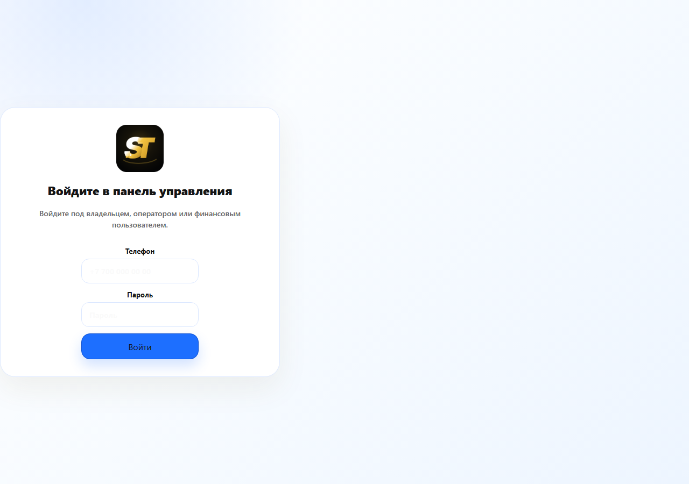
   - After: 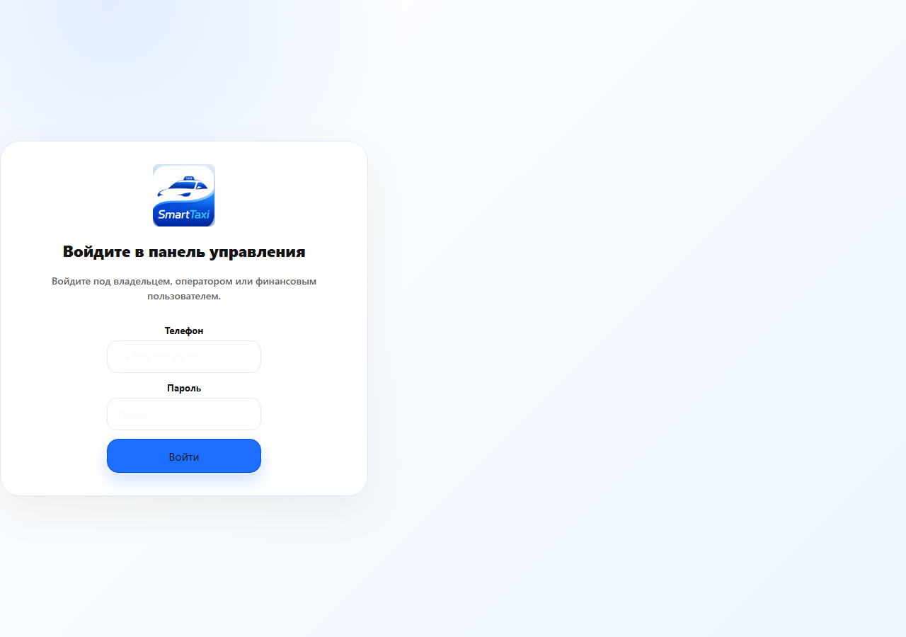

2. **Active nav/tab/segmented-filter pills rendered gold, not blue.**
   The admin sidebar's active page, every `SegmentedFilter` selection
   ("Все", "30 дней", "Активные", etc.) across every admin page, and
   the driver app's tab bar all shared one CSS rule
   (`.admin-control-shell button.active`, `.driver-core-tabs
   button.active`, plus client CTA selectors, duplicated near-
   identically at two places in `styles.css`) with a hardcoded
   `background: linear-gradient(...gold...) !important`. The rest of
   the admin UI had already been migrated to blue custom properties
   (`--admin-gold` etc. — stale names, correct blue values), but this
   one older `!important` block was still winning the cascade. Changed
   both duplicate rules' colors to the blue accent already used
   elsewhere in the file (`#1d6fff`/`#0b4fd1`) with white text instead
   of dark ink (needed for contrast on a saturated blue vs. the
   original pale gold). One CSS fix, confirmed to correct every
   instance across every admin page checked (dashboard, regions,
   drivers, applications, orders, tariffs, finance, payouts, roads,
   quality, raffles, referrals, settings, audit, support) — not just
   the one page it was first spotted on.
   - Before (dashboard): 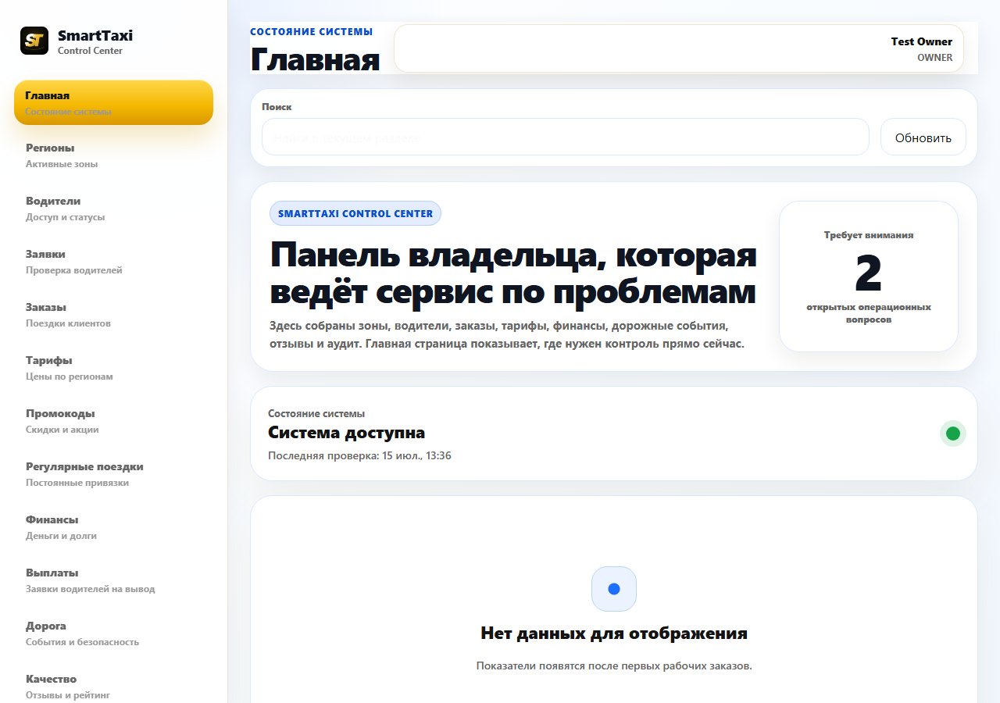
   - After (dashboard): 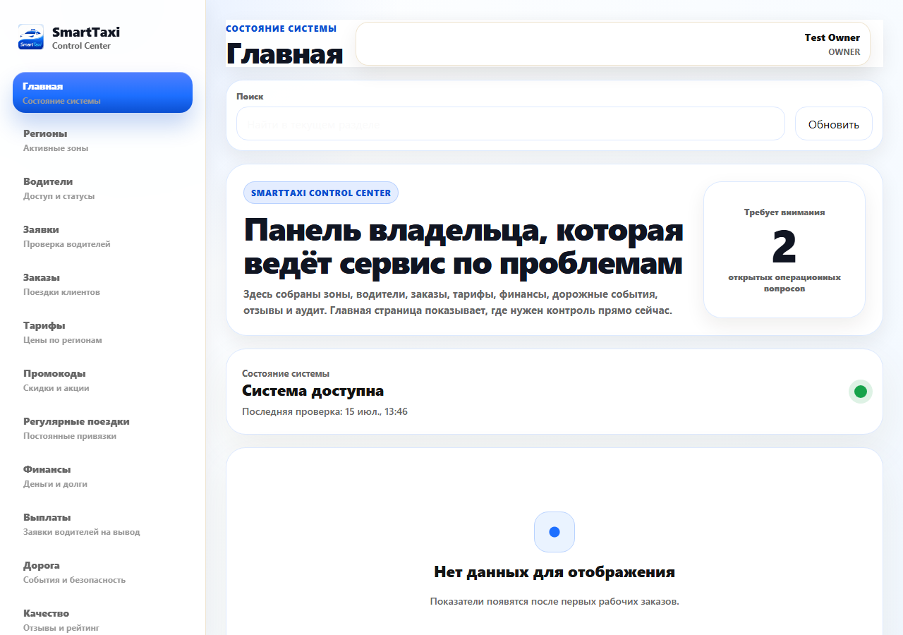
   - Before (Тарифы — segmented filter + date range both gold): 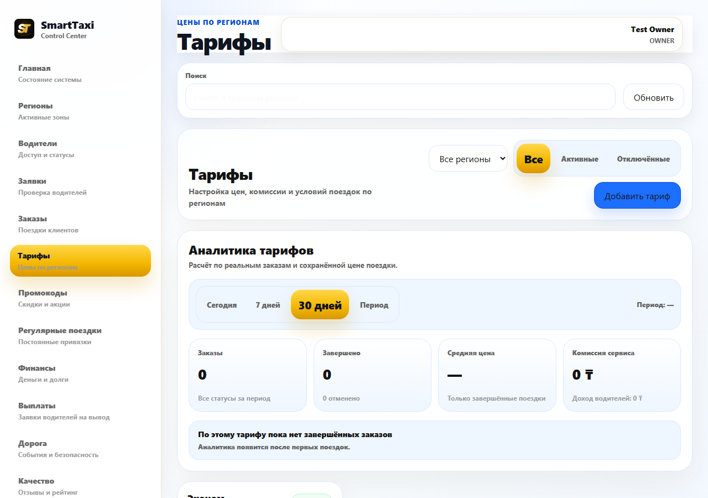
   - After (Тарифы): 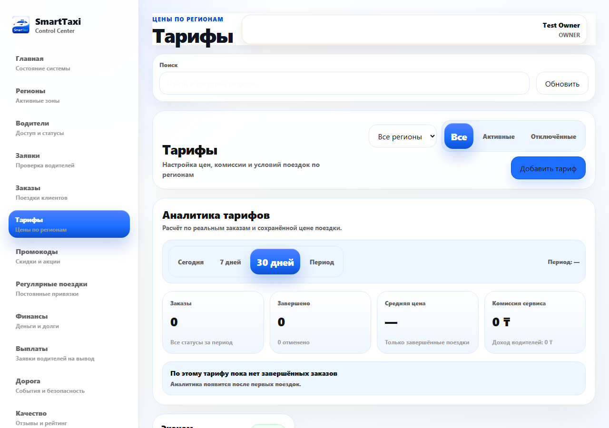

**Design-system deviations — found, documented, deliberately not
fixed** (don't match the doc, but fixing them properly means either
new design assets I don't have or a large, risk-of-regression repaint
of an already-tuned screen — the doc explicitly says "don't do a
blanket repaint pass unless explicitly asked"; these are flagged for
opportunistic follow-up, ideally by whichever session owns
auth/branding assets, per `project_parallel_sessions` memory):

3. **Client & driver auth/splash screens** still use the pre-blue
   cream gradient background, gold "S" mark, and gold shield icon — a
   completely separate SVG/PNG asset set
   (`authWelcomeUi`/`.../svg/brand/smarttaxi_s_mark.svg`, `.../
   background/auth_hero_photo_soft.png`) from the one `SmartTaxiLogo`
   fix above, so that fix didn't reach it. The design doc claims a blue
   splash gradient is "already implemented on the auth screens
   tonight" — that doesn't match what's actually live; either that
   was mobile-only or hasn't landed on web yet. Needs real blue-themed
   hero/wordmark assets, not a find-replace.
   - 
   - 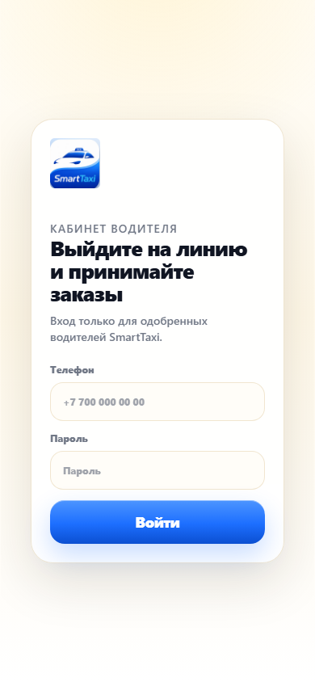
4. **Trip flow screens** (`.trip-stage-screen`, `.trip-searching-
   screen` — the "Мои поездки" empty state and the driver-search/
   driver-found/active-trip screens) use a hardcoded warm ivory
   gradient (`#fffaf0`/`#f7f3ea`) with matching warm-toned shadows and
   borders throughout, entirely independent of the `--taxi-*`
   variables the rest of the client app already uses. This is the
   single biggest remaining visual deviation and covers the most
   important screens in the app (the whole active-ride experience),
   but properly fixing it means re-tuning many coordinated shadow/
   border colors together, not swapping one background line — flagged
   rather than rushed.
   - 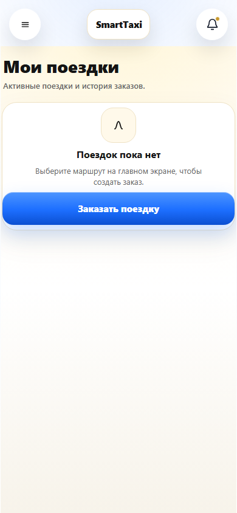
5. **Unverified, code-only finding**: the same stale-gold `!important`
   pattern from fix #2 also covers `.driver-core-status.online` (the
   driver's online/offline pill) and the selected-tariff radio dot in
   `.reference-tariff-state` — grep-confirmed in `styles.css` but not
   screenshotted, since reaching those screens needs a live driver
   session this environment can't provide. Worth a quick visual check
   next time someone's in the driver app.

## 14. Desktop density pass (running via `/loop`, iteration 1)

New ask, separate from the visual audit above: enforce dense-admin
conventions across `/client /driver /owner` — 4/8/12/16/24/32px
spacing scale, bordered/divided table rows instead of per-row rounded
cards for data-dense lists, semantic badge colors kept apart from
accent blue, one filled CTA per screen, real empty states everywhere,
and one consistent typography hierarchy between `/client` and
`/owner`. Running this as a self-paced `/loop` per the user's
instruction, with a hard rule: a screen isn't "done" until it's opened
live in a real browser, screenshotted, and checked against
`BLUE_WHITE_DESIGN_SYSTEM_2026-07-15.md` — a previously-committed fix
that fails that check on re-inspection still counts as not done.

**Tooling**: same as §13 — Browser pane's `computer{screenshot}`
still hangs, so this iteration used the same throwaway Playwright
script approach (network-mocked admin auth, real navigation) to get
real screenshots. Script deleted after each run, not committed.

**Iteration 1 — admin dense tables (Заявки, Промокоды, Водители)**:

1. **Core fix**: `.admin-table`/`.admin-table-row` rendered every row
   as its own separate rounded, bordered, drop-shadowed box with gaps
   between rows — the exact "cards masquerading as a table" pattern
   the user called out. Converted to one bordered/rounded *container*
   with plain `border-bottom` dividers between rows (last row's border
   removed, subtle hover tint added). This one change reached every
   screen already using `.admin-table-row` — Водители, Заказы,
   Журнал, Финансы reports/debts/transactions — not just the two
   screens named explicitly.
2. **Заявки (driver applications) and Промокоды (promo codes)**: were
   still on the old `.admin-card-grid` + rounded-card-per-item
   pattern (never actually reached by the table-row fix above). Both
   restructured to the new dense row layout.
3. **Badge color bug found by the fix above**: `.admin-badge.warning`
   used `background: var(--admin-gold-soft)` / `border-color:
   var(--admin-border-strong)` — both stale-named variables that
   (per §13's finding) actually hold *blue* values now. So the
   "warning" badge (PENDING/BUSY/searching statuses) rendered with
   amber text on a pale **blue** chip — exactly the "reusing accent
   for status" the user said not to do. Fixed to a proper light-amber
   background/border, independent of the accent tokens.
4. **Also promo-codes only**: the row's "Отключить" action was styled
   `admin-danger-button` (red) — same as "Удалить". Deactivating is
   reversible, deleting isn't; recolored "Отключить" to secondary so
   only the actually-irreversible action reads as danger.
5. **Two real layout bugs caught only by the screenshot self-check**
   (not visible from reading the code or from `npm run check`):
   - Nesting name+phone in a wrapping `
` per row (to get a
     two-line first cell) broke the grid's column count assumption —
     rendered as smooshed, overlapping text with no gaps. Fixed by
     matching the flat `<strong>`/`` sibling pattern the
     already-working Drivers/Orders rows use, giving Заявки/Промокоды
     their own dedicated column-count rules instead of sharing one
     with Orders.
   - **Pre-existing bug, not something this session introduced**: the
     driver row's status badge and region-name column visually
     overlapped (`admin-badge` also matched the generic `.admin-table-
     row span` rule, which forced `min-width:0` and let the grid's
     `auto` track collapse to ~26px against the badge's real ~83px
     content). Added a targeted `.admin-table-row .admin-badge`
     override restoring natural sizing. Also removed the redundant
     per-row "Заблокировать" button on Водители — it duplicates the
     block/unblock action already in the driver-detail modal opened by
     "Детали", and freeing that column width is what let the row
     actually fit at 1280px instead of clipping.
   - Iterated column `minmax()` values down from "generous guesses"
     to values that actually fit a 1280px viewport without overflow,
     re-screenshotting after every change — several rounds before
     Промокоды and Водители both rendered fully on-screen with no
     clipped buttons.

- Before (Заявки — rounded cards, one per applicant):
  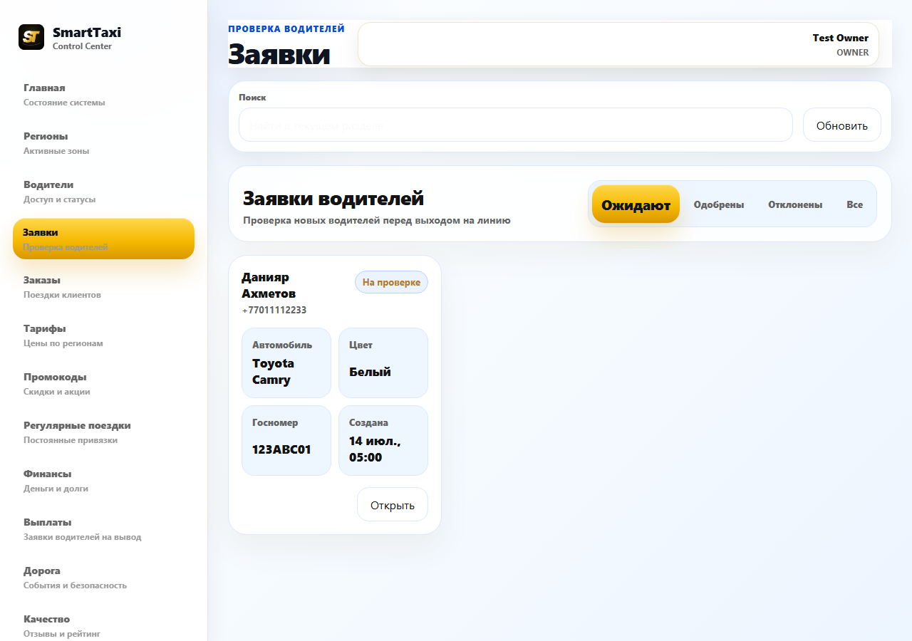
- After (Заявки — divided rows, semantic amber badge):
  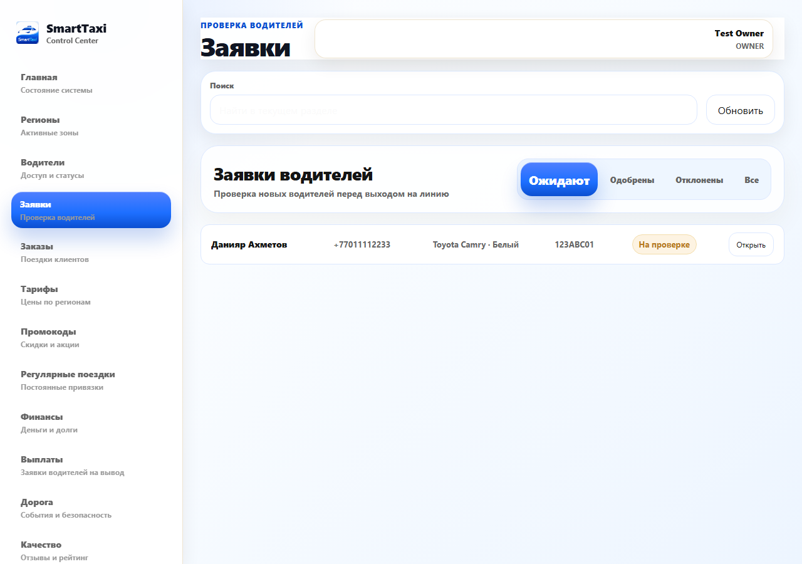
- Before (Промокоды — rounded cards):
  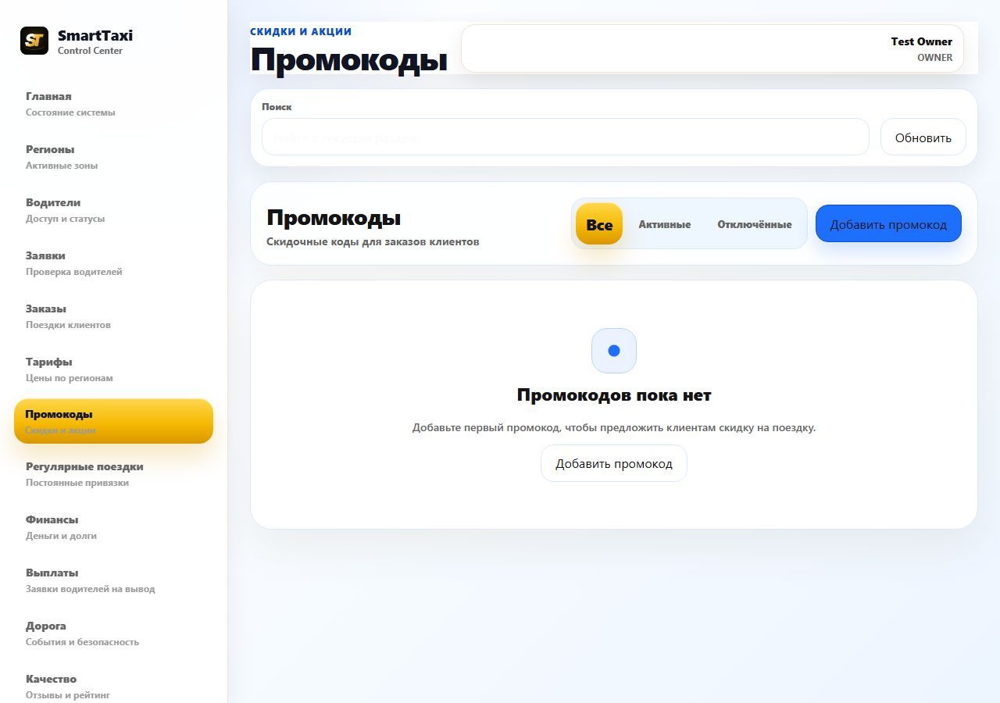
- After (Промокоды — divided rows, "Отключить" no longer styled as danger):
  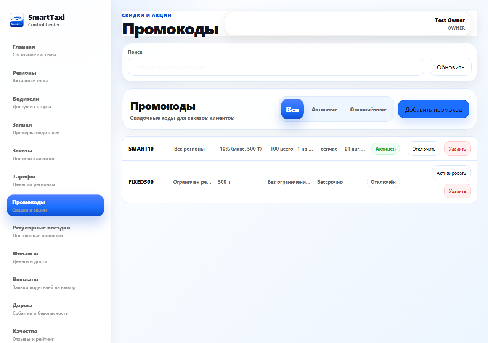
- After (Водители — divided rows, badge/region overlap fixed, badges
  now green/amber/red instead of blue-tinted):
  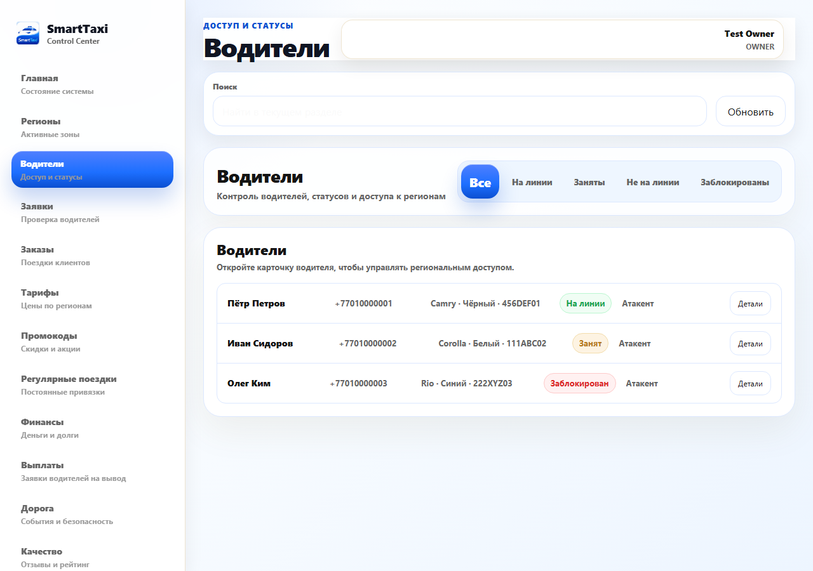

**Iteration 2 — CTA hierarchy, empty states, typography check**:

- **Empty states**: grepped every list-rendering branch in
  `AdminApp.jsx` — 23 separate `!x.length ? <StatePanel ...>` guards,
  one per list (regions, drivers, applications, orders, tariffs,
  finance reports/debts/transactions, road alerts, support, promo
  codes, recurring bookings, referrals, raffles, payouts, leaderboard,
  reviews, audit, driver/application documents). None render a bare
  empty table. Combined with §13's earlier finding (no empty/dead
  screens found across the whole app), this requirement was already
  satisfied — no code change needed, just verified.
- **One CTA per screen**: found the real version of this problem
  wasn't "two page-level `Добавить X` buttons competing" (there was
  never more than one of those) — it was *row-level* actions styled as
  the same solid accent blue as the page's one real CTA, so a list of
  10 pending payouts had 10 blue "Одобрить" buttons all competing for
  attention alongside the sidebar's blue active-page pill. Restyled
  the repeating row actions (Выплаты's "Одобрить"/"Отметить как
  выплачено", and the per-document "Одобрить" in the applications/
  driver document review) from `admin-primary-button` to
  `admin-secondary-button` — danger actions (Отклонить/Удалить) stay
  red, the *page's* one real call-to-action (Добавить розыгрыш/тариф/
  промокод/регион) stays the only solid blue element on screen.
  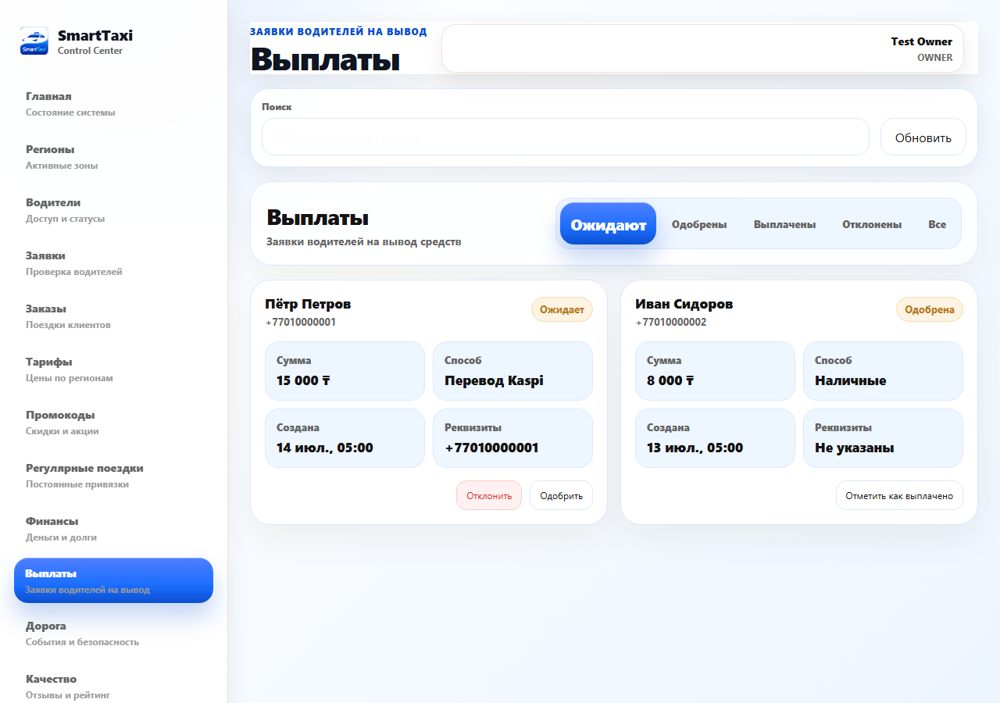
  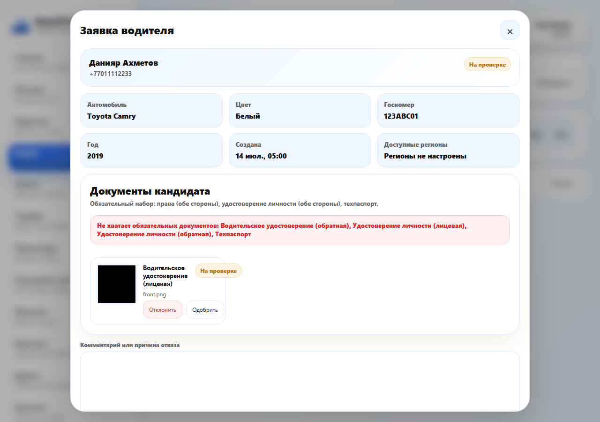
- **Typography hierarchy, /client vs /owner**: compared
  `.taxi-pwa .screen-intro h1` (28px/34px, weight 850, tightened to
  `clamp(27px,7vw,33px)` on menu/drawer-linked screens) against
  `.admin-section-header h2` (28px/34px, weight 950) — same size, same
  line-height, weight within 100 units of each other (both read as
  "bold display heading" at a glance). Subtitle text matches too (14px
  both sides). Screenshotted side-by-side (Настройки vs Главная) to
  confirm visually, not just from the CSS — genuinely already
  consistent, nothing to fix here.
  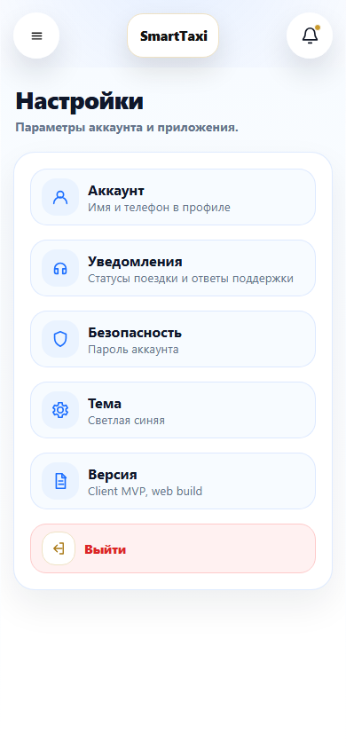
  
- **Known technical debt, not fixed**: client CTA buttons are still
  classed `primary-gold` (e.g. `Button className="wide primary-gold"`)
  in 16+ places. Confirmed via computed styles this renders genuinely
  **blue** already (`#1d6fff`/`#0b4fd1`, white text) — a later
  `!important` block overrides the original gold gradient, same stale-
  naming pattern as `--admin-gold`/`--taxi-gold` from §13. Purely a
  class-name/maintainability issue with zero visual symptom (every
  client screenshot tonight already shows blue buttons) — renaming it
  across every call site would touch client and driver code for no
  screenshot-visible benefit, so left as a documented note rather than
  a risky mass rename mid-loop.

**Not yet done — loop continues**: spacing-scale check specifically on
`/client` and `/driver` screens (checked visually via screenshots so
far, not grepped for stray non-scale px values), `/driver` app screens
beyond the login page (still blocked — no live backend to get past
driver auth), and the final confirmation sweep once a full pass turns
up nothing new.

## Known gaps / follow-ups

- Referral code redemption at signup (see §8) — backend-ready, not
  wired on purpose.
- A full logged-in click-through of the three new admin pages against
  a real database wasn't possible tonight (no local backend). They're
  syntax-checked, pattern-matched against working sibling pages, and
  sample-data-rendered via a temporary fetch mock in the live preview,
  but not integration-tested.
- Price-offer card and quick-message bar/toast (see §10) are likewise
  not integration-tested against a live order — same missing local
  backend, plus no easy way to fast-forward to those order states
  without one.
- Raffles, per-raffle leaderboard filtering, and review deletion (see
  §11) need three backend additions before they do anything beyond
  render: `GET/POST/DELETE /api/admin/raffles`, `dateFrom`/`dateTo`
  support on `GET /api/admin/leaderboard`, and
  `DELETE /api/admin/reviews/:id` (with a rating re-average).
- `apps/web/src/features/client/ClientApp.jsx.tmp` — an empty, untracked
  stray file already present in the tree at session start. Left alone
  (not mine, might be another session's in-progress marker).
- Client/driver auth-splash cream/gold background and hero/wordmark
  assets, and the trip-flow screens' warm ivory background (see §13,
  items 3-4) — real deviations from the blue/white design system,
  deliberately left for a dedicated pass rather than rushed tonight.
- `.driver-core-status.online` and the selected-tariff radio dot (see
  §13 item 5) likely share the same stale-gold `!important` rule fixed
  for nav/tabs, but weren't visually confirmed — no way to reach an
  authenticated driver screen without a live backend this session.

## Commits (chronological)

1. `Add admin promo codes CRUD, recurring bookings and referrals overview`
2. `Wire client favorites/promo/support/referral to real backend contracts`
3. `Align favorites/referral/support payloads with the real backend contract`
4. `Wire driver price-offer negotiation and quick messages into ClientApp`
5. Raffles/ratings/commission-label/payouts (§11) landed in the working
   tree but got swept into an unrelated parallel session's commit
   (`4e2fc87`, "Mobile: redesign tariff selection as a horizontal
   carousel") due to a git index race — see
   `feedback_git_staging_race` memory. Code is real and verified as
   described above; the commit message just doesn't mention it.
6. `Add driver document verification to the admin applications/drivers panels`
7. Visual audit + design-system fixes (§13): blue app icon everywhere,
   and the stale gold `!important` active-tab/pill rule corrected to
   blue across the whole admin panel and driver tab bar.
